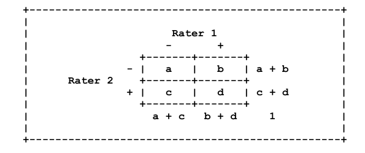
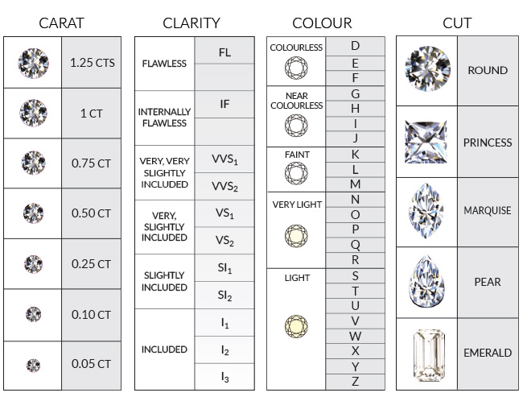

<center>**Alain Cabrera**</center>
<center>**Rodrigo Murillo**</center>
<center>**Stephane Keil**</center>

El análisis de componentes principales parte de la matriz de correlaciones de las variables. El problema radica cuando, en el conjunto de variables, se contienen variables ordinales pues es necesario calcular las correlaciones entre dichas variables y correlaciones de las variables continuas con ellas.

A continuación se presentan alternativas para calcular dichas correlaciones. Para el caso de dos variables ordinales usaremos el *Polychoric Correlation Coefficient* y  para calcular la correlación entre una variable ordinal y una continua se utilizará el *Polyserial Correlation Coefficient*.

Estos métodos están implementados en el paquete en el paquete **psych** de **R**.

## Polychoric Correlation Coefficient 

La correlación *polychoric* es una técnica que permite estimar la correlación entre pares variables latentes (normalmente distribuida) que correspondan a dos variables ordinales. En el caso particular de que las variables seas dicotómicas entonces se le conoce con el nombre de correlación *tetrachoric*.

A continuación se muestra el cálculo para el caso particular de una variable dicotómica. En la siguiente elipse se muestra la distribución conjunta de un evento desde la perspectiva de dos jueces ($Y_{1}$ y $Y_{2}$) y las tolerancias $t_{1}, t_{2}$.


Los valores de $a, b, c$ y $d$ corresponden a la proporción de casos que caen en cada una de los casos mostrados en la elipse. 



Por lo que sólo es necesario estimar el modelo representado por la elipse para encontrar los puntos de $t_{1}$ y $t_{2}$ así como el parámetro $\rho$ (rho) que determina la forma de la elipse. La forma en que se calcula dicha correlación es encontrando la cambinación de $t_{1}, t_{2}$ y $\rho$ que hacen que las proporciones de $a, b, c$ y $d$ observadas sean similares a las de la elipse.

El cálculo para el caso general no es tan sencillo, inlcuso en la historia de la estadística este tipo de correlación era conocidad por la dificulatad que implicaba cálculo. Para simplificar el cálculo Pearson creó tablas que ayudaban a calcular las series, sin embargo hoy en día se obtiene utilizando softwares especializados.

Suponiendo que la tabla de contigencia tiene la estructura anterior, entonces el coeficiente de correlación se puede calcular utilizando la regla de Cole (1949):

$$ \rho = \cos \left(\frac{180°}{1 + \sqrt{\frac{bc}{ad}}} \right) $$

## Polyserial Correlation Coefficient
El coeficiente de correlación *polyserial* es la correlación latente entre una variable continua X y una variable ordinal Y pero asumida para representar una variable continua con distribución normal.

Supuestos:

* Sea $\eta$  una variable latente relacionada con Y a través de una función escalonada no decreciente
$$Y=y_j \text{ si } \tau_{j-1}<\eta<\tau_j$$
* La distribución conjunta de X y $\eta$ sigue una distribución Normal bivariada con $\mu_X$, $\sigma^2_X$ y $\rho_{x\eta}=\rho$ desconocidas y $\mu_\eta=0$, $\sigma^2_\eta=1$
* Las categorías de Y están representadas por enteros consecutivos.
Al cumplirse estos supuestos, se tiene que la correlación *polyserial* entre X y Y es:
$$\rho=\frac{\tilde\rho\sigma_y}{\sum\phi(\tau_j)}$$ en donde $\tilde\rho$ es la correlación de Pearson.

Principalmente se utilizan dos métodos para estimar la correlación:

* **Estimador máximo verosímil**: todos los parámetros son estimados al mismo tiempo.
* **Estimación en dos pasos**: primero se estiman la media y varianza de X por medio de $\bar X$, $S^2_x$ y estimando los límites ($\tau$) por medio de la inversa de la función de distribución normal evaluada en las proporciones marginales acumuladas ($P_i$). Posteriormente se maximiza la función de verosimilitud.

## Paquete psych

```{r include = TRUE}
knitr::opts_chunk$set(fig.dpi = 300, fig.height = 7, fig.width = 7)
library(psych)
```


Este paquete cuenta un diversas funciones, entre ellas tenemos las siguientes:

* polychoric(x): Se utiliza para calcular la correlación entre variables ordinales.
* polyserial(x,y): Se utiliza para calcular la correlación entre una variable continua X y una ordinal Y.
* mixed.cor(x,p,d): Calcula la matriz de correlaciones y toma como parámetros una matriz x con las observaciones de las variables continuas, una matriz p con las observaciones de las variables ordinales y d una matriz con las observaciones de las variables binarias.

Asi se veria una correlación tetrachorica *fuerte*
```{r polychoric, include = TRUE, fig.width=7,fig.height=7}
draw.tetra(.9,2,0.5)
```

Asi se veria una correlación tetrachorica *debil*
```{r include = TRUE}
draw.tetra(.1,0,0)
```


## Ejemplo
```{r include = TRUE, message=FALSE}
library(ggplot2)
```
Se utilizará la base de datos *diamonds* del paquete *ggplot2*. Esta base cuenta con el precio y otros 9 atributos de aproximadamente 53,940 diamantes. Las variables son:

* price. price in US dollars (\$326--\$18,823)
* carat. weight of the diamond (0.2--5.01)
* cut. quality of the cut (Fair, Good, Very Good, Premium, Ideal)
* colour. diamond colour, from J (worst) to D (best)
* clarity. a measurement of how clear the diamond is (I1 (worst), SI1, SI2, VS1, VS2, VVS1, VVS2, IF (best))
* x. length in mm (0--10.74)
* y. width in mm (0--58.9)
* z. depth in mm (0--31.8)
* depth. total depth percentage = z / mean(x, y) = 2 * z / (x + y) (43--79)
* table. width of top of diamond relative to widest point (43--95)




Primero cargarmos la base a un data frame.

Las variables cut, color y clarity son ordinales. Por lo tanto las convertimos en un *ordered factor*
```{r include = TRUE}
dfOrd  <- data.frame(diamonds)
head(dfOrd)
```
Este conjunto de datos es de particular interés en R ya que permite realizar predicciones respecto al precio de un diamante en función de variables continuas y ordinales con más de 5 categorias. Para entender un poco el conjunto de datos incluimos la variación del precio en función de la raiz cubica de los kilates de la piedra dependiendo de su claridad, corte y su color.
```{r funciones, include=FALSE}
library(scales)
cuberoot_trans = function() trans_new('cuberoot',
                                      transform = function(x) x^(1/3),
                                      inverse = function(x) x^3)
```
```{r include = TRUE, echo=FALSE, message=F, warning=F}
ggplot(aes(x = carat, y = price), data = diamonds) + 
  geom_point(alpha = 0.5, size = 1, position = 'jitter',aes(color=clarity)) +
  scale_color_brewer(type = 'div',
    guide = guide_legend(title = 'Clarity', reverse = T,
    override.aes = list(alpha = 1, size = 2))) +                         
  scale_x_continuous(trans = cuberoot_trans(), limits = c(0.2, 3),
    breaks = c(0.2, 0.5, 1, 2, 3)) + 
  scale_y_continuous(trans = log10_trans(), limits = c(350, 15000),
    breaks = c(350, 1000, 5000, 10000, 15000)) +
  ggtitle('Price (log10) by Cube-Root of Carat and Clarity')

ggplot(aes(x = carat, y = price), data = diamonds) + 
  geom_point(alpha = 0.5, size = 1, position = 'jitter',aes(color=cut)) +
  scale_color_brewer(type = 'div',
    guide = guide_legend(title = 'Cut', reverse = T,
    override.aes = list(alpha = 1, size = 2))) +                         
  scale_x_continuous(trans = cuberoot_trans(), limits = c(0.2, 3),
    breaks = c(0.2, 0.5, 1, 2, 3)) + 
  scale_y_continuous(trans = log10_trans(), limits = c(350, 15000),
    breaks = c(350, 1000, 5000, 10000, 15000)) +
  ggtitle('Price (log10) by Cube-Root of Carat and Cut')

ggplot(aes(x = carat, y = price), data = diamonds) + 
  geom_point(alpha = 0.5, size = 1, position = 'jitter',aes(color=color)) +
  scale_color_brewer(type = 'div',
    guide = guide_legend(title = 'Color', reverse = F,
    override.aes = list(alpha = 1, size = 2))) +                         
  scale_x_continuous(trans = cuberoot_trans(), limits = c(0.2, 3),
    breaks = c(0.2, 0.5, 1, 2, 3)) + 
  scale_y_continuous(trans = log10_trans(), limits = c(350, 15000),
    breaks = c(350, 1000, 5000, 10000, 15000)) +
  ggtitle('Price (log10) by Cube-Root of Carat and Color')
```


Posteriormente cambiamos las categorías de las variables ordinales a números consecutivos comenzando desde 1.
```{r include = TRUE, warning=FALSE}
ordNum <- data.matrix(dfOrd)
head(ordNum)
```
Podemos comparar los resultados de aplicar la correlación de Pearson como si los datos ordinales fueran en realidad de intervalo con los resultados de buscar la $\rho$ que mejor describe la elipse de los datos.Los resultados son los siguientes:

* Pearson correlation: $\rho$ = 0.02 
* Polychoric correlation: $\rho$ = 0.03 

Por lo general la correlación de Pearson tiende a subestimar la correlación entre variables ordinales.

```{r include = TRUE, message=FALSE,warning=FALSE}
cor(ordNum[,2],ordNum[,3])
prop.table(table(ordNum[,2],ordNum[,3]))
polychoric(ordNum[,c(2,3)])
```
Calculamos la matriz de correlaciones de las variables utilizando la función mixed.cor.
```{r include = TRUE, message=FALSE, warning=FALSE}
pc <- mixed.cor(x=ordNum,smooth=TRUE, correct=TRUE)
```

```{r include = TRUE}
pc
```

## Análisis de componentes principales

Calculamos los primeros 5 componentes principales para la matriz anterior.
```{r include = TRUE}
faPC <- principal(r=pc$rho, nfactors=5, rotate="none",scores=TRUE)
```

```{r include = TRUE}
faPC
```

Para encontrar la representación de alguna observación en las nuevas coordenadas podemos utilizar la función predict.
```{r include = TRUE}
predict(faPC,ordNum[1,],ordNum)
fa.plot(faPC)
fa.diagram(faPC)
```

Para determinar que variables contribuyen a cada una de las componentes principales podemos utilizar un Biplot. Les proponemos nombrar cada una de las componentes en base a estas variables.

* **Componente 1**: Correlación positiva x, y, z y carat --> Tamaño de la piedra 
* **Componente 2**: Correlación positica corte y negativa a tabla --> Tamaño de la piedra --> Finesa
* **Componente 3**: Correlación positiva tabla y negativa a profundidad --> Tamaño de la piedra --> Forma de la piedra
* **Componente 4**: Correlación positiva color y claridad --> Tamaño de la piedra --> Pureza de la piedra
* **Componente 5**: Correlación positiva claridad y negativa a color --> Irridescencia de la piedra

```{r include = TRUE}
faPC$scores <- factor.scores(ordNum,faPC)   
biplot.psych(faPC,choose=c(1,2),main = "Componente 1 vs Componente 2")
biplot.psych(faPC,choose=c(1,3),main = "Componente 1 vs Componente 3")
biplot.psych(faPC,choose=c(2,3),main = "Componente 2 vs Componente 3")
biplot.psych(faPC,choose=c(4,5),main = "Componente 4 vs Componente 5")
```

## Referencias
* Olsson, U., Drasgow, F., & Dorans, N. J. (1982). *The polyserial correlation coefficient*. Psychometrika, 47(3), 337-347.
* Rodíguez, M.E., Álvarez, S., Bravo, E. (2001). *Coeficientes de asociación.* Universidad Autónoma Metropolitana.
* Uebersax JS. *The tetrachoric and polychoric correlation coefficients.* Statistical Methods for Rater Agreement. Web, accessed <18-02-2017>.


