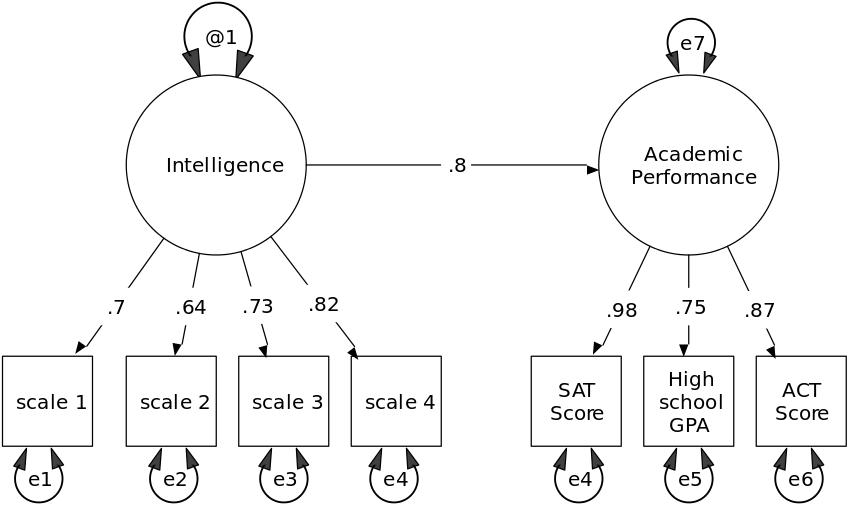

```{r setup, include=FALSE}
knitr::opts_chunk$set(echo = TRUE, fig.align = "center", 
                      message=FALSE, warning=FALSE)
```

## Ecuaciones Estructurales


### Introduccion 

El Analisis Factorial se usa para determinar que variables estan mas relacionadas con los factores mas comunes y cuantos factores son necesarios para "explicar" nuestro dataset a un nivel aceptable.

El analisis factorial es una buena herramienta para la exploracion temprana de un dataset. Sin embargo, dado el avance en alguna investigacion o conocimientos de los datos podriamos pensar en realizar un analisis de confirmacion factorial.

Un analisis de confirmacion factorial esta motivado por supuestos o consideraciones teoricas, analisis exploratorio, o analisis factorial; por lo que condicionariamos ciertos loadings a cero.  Generalmente, dado un analisis factorial en cierta poblacion, se usaria un analisis de confirmacion factorial en un hold-out set.

Los modelos de analisis de confirmacion factorial <i>(Confirmatory Factor Analysis) </i> son ejemplos relativamente simples de un marco mas general para modelar variables latentes y se conocen como modelos de ecuacion estructural o modelos de estructura de covarianza. En estos modelos, se asume nuevamente que las variables observadas son indicadores de las variables latentes subyacentes, pero ahora se incorporan las ecuaciones de regresion que enlazan las variables latentes.

El objetivo de las ecuaciones estructurales es explicar las correlaciones o covarianzas de las variables observadas en terminos de las relaciones de estas variables con las variables latentes subyacentes asumidas y las relaciones postuladas entre las mismas variables latentes. 

Los origenes de los <i> Modelos de Ecuaciones Estructurales </i> (SEM) son
tecnicas desarrolladas hace 90 años por Stewal Wright (Wright 1921), dentro del
campo de la genetica, cuyo proposito fue el de permitir "el examen de un conjunto
de relaciones entre una o mas variables independientes, sean estas continuas o discretas" desarrollando una forma de romper las correlaciones observadas en un sistema de ecuaciones matematicas que describan sus hipotesis respecto a unas relaciones
causales. Estas relaciones entre las variables fueron representadas en un path
diagram, conociendose este metodo como path analysis.

<br>


<br>


### Estimacion, identificacion y evaluacion del ajuste para SEM

### Estimacion 

Un modelo de ecuaciones estructurales contiene un conjunto de parametros que se estiman a partir de la covarianza o matriz de correlaciones de las variables observadas. 

El proceso de estimacion busca encontrar valores para los parametros del modelo que minimicen una funcion de diferencia La funcion de diferencia indica las distancia entre  dos matrices, la matriz de covarianzas de las variables observadas, $S$. Asi como $\Sigma(\theta)$ la matriz de covarianzas implicada por el modelo ajustado, los elementos de esta matriz son funciones de los parametros del modelo, contenidos en el vector $\theta= (\theta_1,...,\theta_2)^T$.

El metodo mas comun para estimar los parametros en un modelo de ecuaciones estructurales es el metodo de maxima verosimilitud, asumiendo que los datos observados sigan una distribucion normal multivariada. Al usar este metodo, aumentar la verosimilitud se vuelve equivalente a minimizar la funcion de discrepancia dada por:

$$ FML(S, \Sigma(\theta))=log|\Sigma(\theta)|-log|S|+tr(S\Sigma(\theta)^-1)-q$$
Podemos ver que al ir variando los parametros $\theta_1,...\theta_t$ para que $\Sigma(\theta)$ se parezca mas a $S$, $FML$ se vuelve mas pequeña. Para minimizar la funcion $FML$ se necesitan algoritmos numericos. 

### Identificacion 

Consideremos el modelo con tres variables observadas $x$, $x'$ y $y$ y dos variables latentes, $u$ y $v$ con las relaciones entre las variables observadas y las latentes dadas por:

$$
x=u+\delta  \\
y=v+\epsilon \\
x'=u+\delta'
$$

Si asumimos que $\delta$, $\delta'$ y $\epsilon$ tienen valores esperados de cero, que $\delta$ y $\delta'$ no se correlacionan entre si ni con $u$, y que  $\epsilon$ no se correlaciona con $v$, la matriz de covarianzas de las variables observadas se puede expresar en terminos de parametros que representen las varianzas y covarianzas de los residuales y de las variables latentes:
$$
\Sigma(\theta)=
\begin{bmatrix}
    \theta_1+\theta_2\\
   \theta_3    & \theta_4+\theta_5\\
    \theta_3 & \theta_4 & \theta_4+\theta_6
\end{bmatrix}
$$
donde $\theta^T=(\theta_1, \theta_2, \theta_3, \theta_4,\theta_5,\theta_6)$ y $\theta_1=Var(v)$, $\theta_2=Var(\epsilon)$, $\theta_3=Cov(v,u)$, $\theta_4=Var(u)$, $\theta_5= Var(\delta)$ y $\theta_6=Var(\delta')$. Como podemos ver la estimacion de los parametros de este modelo presenta un problema. Los parametros $\theta_1$ y $\theta_2$ no tienen una forma unica de determinarse porque si se aumenta uno en alguna cantidad y se disminuye el otro en la misma cantidad, no se altera la matriz de covarianzas predicha por el modelo. Es decir, diferentes $\theta_s$ pueden resultar en la misma matriz de covarianzas. Este tipo de modelos se llaman inidentificables. Un modelo es identificable si y solo si $\Sigma(\theta_1)=\Sigma(\theta_2)$ implica que $\theta_1=\theta_2$. Esta propiedad depende de la eleccion del modelo y en la especificacion de parametros fijos, parametros con ciertas restricciones (por ejemplo dos parametros con la restriccion de que sus valores deben ser iguales) y parametros libres. En general una dificultad es determinar si un modelo es identificable o no, una condicion necesaria mas no suficiente para que un modelo sea identificable es que el numero de parametros libres $t$ del modelo sea menor a $q(q+1)/2$l.

### Evaluando el ajuste del modelo. 
Ya que se determina que el modelo es identificable y se estiman los parametros, el siguiente paso es evaluar que tan bien se ajusta la matriz de covarianzas predicha por el modelo con la matriz de covarianzas de las variables observadas. Una medida global del ajuste del modelo esta dado por el "likelihood ratio": 
$$
X^2=(N-1)FML_{min} 
$$

donde $N$ es el tamaño de la muestra y $FML_{min}$ es el valor minimo de la funcion de discrepancia de maxima verosimilitud. Si el tamaño de la muestra es lo suficientemente grande, $X^2$ permite probar si la matriz de covarianzas de la poblacion de las variables observadas es igual a la matriz de covarianzas estimadas por el modelo, la hipotesis alternativa es que la matriz de la poblacion no tiene restricciones.

Bajo la hipotesis de igualdad entre las matrices, $X^2$ sigue una distribucion chi-cuadrada con $v$ grados de libertad dados por $\frac{1}{2}q(q+1)-t$, donde $t$ es el numero de parametros libres del modelo. 

La mejor forma de evaluar el ajuste del modelo es utilizar la medida de $X^2$ junto con uno o mas de los siguientes metodos:

1) Inspeccion visual de las covarianzas residuales (las diferencias de las covarianzas de las variables observadas y las covarianzas predichas por el modelo). Las covarianzas residuales deben ser pequeñas al compararse con los valores observados de covarianzas o correlaciones. 
2)Examinar los errores estandar de los parametros y las correlaciones entre estos estimados, si existe una gran correlacion esto puede ser un indicador de que el modelo no es identificable. 
3)Observar si existen parametros que se salen del rango debido, por ejemplo varianzas negativas o correlaciones mayores a uno. Este tipo de valores indicarian que el modelo ajustado es incorrecto.
Tambien se han sugerido otros indices del ajuste que pueden ser utiles. Por ejemplo el indice de bondad de ajuste (GFI) esta basado en la proporcion de la suma de cuadrados de las distancias entre la matriz observada y la matriz estimada por el modelo. El GFI mide la cantidad de varianza y covarianza presente en $S$ que se encuentra representada en la matriz de covarianzas predicha por el modelo $\Sigma(\theta)$. En el caso de estimacion por maxima verosimilitud el valor de GFI esta dado por:
$$
GFI=1-\frac{tr(S\hat\Sigma^{-1}-I)(S\hat\Sigma^{-1}-I)}{tr(S\hat\Sigma^{-1}S\hat\Sigma^{-1})}
$$

El GFI toma valores entre cero y uno, en la practica solo valores arriba de .9 o .95 sugieren un ajuste aceptable. Otra medida es el AGFI que ajusta el GFI para el numero de grados de libertad del modelo en relacion al numero de variables. Este esta dado por:
$$
AGFI=1-(k/df)(1-GFI)
$$
Donde $k$ es el numero de valores unicos en $S$ y $df$ es el numero de grados de libertad del modelo. Otro indice para evaluar el ajuste del modelo es el RMSR (root-mean-square-residual), que es la raiz cuadrada del promedio de las diferencias elevadas al cuadrado entre $S$ y $\hat\Sigma$, para este  indice un valor menor a .05 indica un buen ajuste. 


---

### Modelo

Este ejemplo muestra como estimas un modelo de ecuaciones estructurales (SEM), usando el paquete `sem` y el paquete `lavaan` de R. 

Este modelo de ecuaciones estructurales consiste en dos modelos de medicion, uno de inteligencia y otro del sentido del humor. Se supone que la inteligencia es una variable latente que pude medirse con los resultados de las pruebas en cuatro areas:
lectura, escritura, matematicas y analisis. Se supone que el humor es una variable latente que se puede medir por lo mucho que uno disfruta ver los programas: <i>The Simpsons, American Dad, and Family Guy.</i> El modelo tambien consiste en un consiste en conectar la inteligencia con el humor.


---

### Ejemplo


```{r, message=FALSE, warning=FALSE}
# 0. Librerias
library(tidyverse)
library(forcats)
library(foreign)
library(qgraph)
library(sem)
library(lavaan)
library(semPlot)
theme_set(theme_bw())
```

Los datos se leen de un servidor de [methods consultants](https://www.methodsconsultants.com) los datos estan en formato PASW (SPSS).

```{r}
# 1. Datos
data <- read.spss("http://www.methodsconsultants.com/data/intelligence.sav", 
                  to.data.frame=TRUE)
head(data)
```

Las ecuaciones estructurales se estiman usalmente usando la matriz de covarianza de las observaciones. 

Realizamos un analisis exploratorio de la covarianza entre las variables del modelo y se observa que se forman dos grupos uno de los programas The Simpsons, American Dad, and Family Guy.</i> y otro de inteligencia lectura, escritura, matematicas y analisis. Las variables con mayor coarianza entre ellas son mateaticas con lectura. 

```{r, fig.width=5, fig.height=4}
data.cov <- cov(data)
data.cov %>% 
  as_tibble() %>% 
  mutate(nom = rownames(data.cov)) %>% 
  gather(var.lab, var.val, -nom) %>% 
  mutate(var.val2 = ifelse(var.lab == nom, NA, var.val), 
         nom = factor(nom, levels = c('reading', 'writing', 'math', 
                                      'analytic', 'simpsons', 
                                      'familyguy',  'amerdad')),
         var.lab = factor(var.lab, levels = c('reading', 'writing', 'math', 
                                      'analytic', 'simpsons', 
                                      'familyguy',  'amerdad'))) %>% 
  ggplot(aes(x = nom, y = var.lab, fill = var.val2)) + 
  geom_tile() + 
  ylab(NULL) + xlab(NULL) +  
  theme(axis.text.x = element_text(angle = 90)) + 
  guides(fill = guide_legend("covarianza"))
```

```{r, fig.width=5, fig.height=4}
qgraph(cov(data), borders = FALSE, layout = "spring")
```


#### Libreria SEM

##### Especificacion del modelo 

El usario especifica el modelo, ya sea directo en R o desde un `.txt`. La sintaxis para `sem::specifyModel()` es la siguiente:

- La primera entrada es la relacion entre variables. Cuando se usa `->` se indica que es un coeficiente de regresion y cuando se usa `<->` representa la varianza o covarianza. 

- La segunda entrada es un nombre aleatorio que se la da al parametro que se va a estatimar. Al introducir `NA` se indica que al parametro se le da un valor en especifico. 

- La tercera entrada es el valor incial o el valor especifico de los parametros.

Un vez que se tiene el modelo y la matriz de covarianza se usa la funcion `sem::sem(modelo, matriz, número de observaciones)`.

```{r}
# 3. libreria SEM
cat(file = "sem_intellect.txt",
"humor -> simpsons, NA, 1
humor -> familyguy, l2, NA
humor -> amerdad, l3, NA
intell -> reading, l4, NA
intell -> writing, l5, NA
intell -> math, l6, NA
intell -> analytic, l7, NA
intell -> humor, g1, NA
simpsons <-> simpsons, e1, NA
familyguy <-> familyguy, e2, NA
amerdad <-> amerdad, e3, NA
reading <-> reading, d1, NA
writing <-> writing, d2, NA
math <-> math, d3, NA
analytic <-> analytic, d4, NA
intell <-> intell, NA, 1
humor <-> humor, z1, NA")

specify.sem <- sem::specifyModel(file = "sem_intellect.txt")
fit.sem <- sem::sem(specify.sem, data.cov, N = 100)
summary(fit.sem)
```

```{r, fig.keep='first'}
pathDiagram(fit.sem)
```

<br>


<br>


#### Libreria Lavaan

En `lavaan` no se necesita la funcion que especifica al modelo aunque si se debe especificar un modelo y la forma de hacerlo es la siguiente:

- El operador `=~` define las variables latentes

- El operador `~` define una regresion

- El operador `~~` indica correlacion 

Un vez que se tiene el modelo y la matriz de covarianza se usa la funcion `lavaan::sem(modelo, matriz)`.

```{r}
model <- "
# latent variable definitions
humor =~ simpsons + familyguy + amerdad
intell =~ reading + writing + math + analytic
# regressions
intell ~ humor
"

fit.lav <- lavaan::sem(model, data = data)
lavaan::summary(fit.lav, standardized=TRUE)
```

```{r}
lavaan::coef(fit.lav) %>% sort()
```


```{r, fig.width=11, fig.height=6}
semPaths(fit.lav, "std", curvePivot = T, layout = "circle2")
```


```{r}
lavaan::modindices(fit.lav)
```

En `levaan` no es necesario dar nombre a los parametros ni especificar la varianza. 


---

### Referencias
- http://www-personal.umich.edu/~gonzo/papers/sem.pdf

- http://masteres.ugr.es/moea/pages/curso201314/tfm1314/tfm-septiembre1314/memoriamasterantonio_lara_hormigo/!

- https://www.methodsconsultants.com/tutorial/structural-equation-models-using-the-sem-package-in-r/
