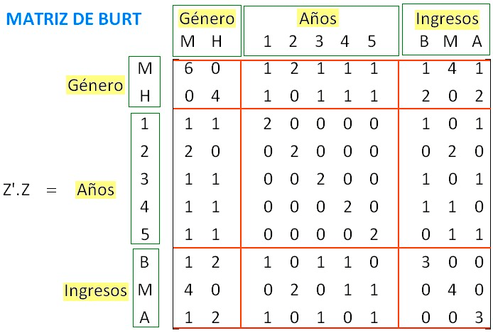
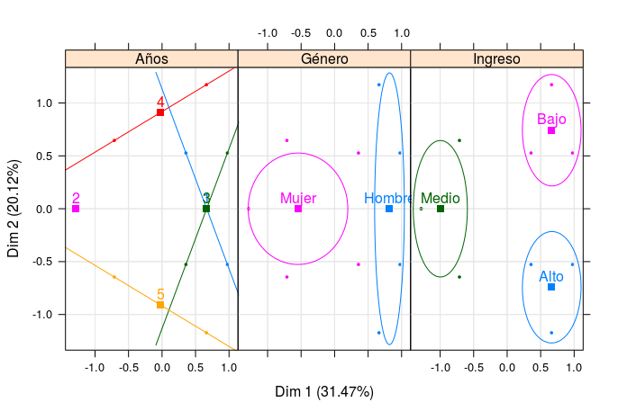
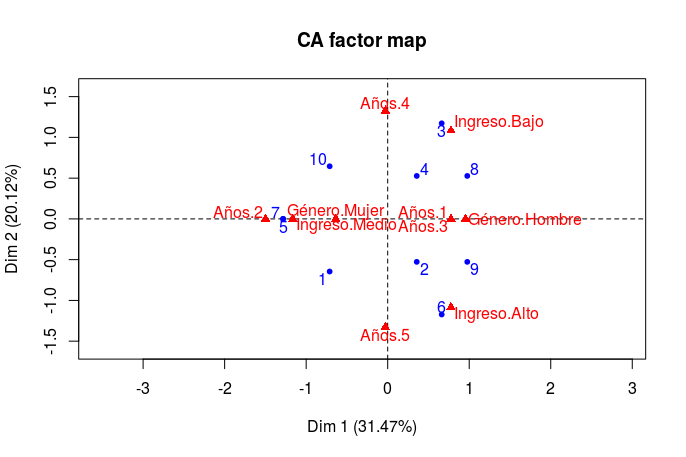

##Análisis de correspondencias múltiples

ACM puede ser visto como una extensión del análisis de correspondencias simple (AC) para un conjunto grande de variables categóricas. Supongamos que la matriz de datos categóricos es $NxQ$ es decir, $N$ individuos y $Q$ variables, el análisis de correspondencias múltiple (ACM) tiene 2 versiones. En la primera transformamos los casos clasificados por variables en una matriz binaria $Z=[Z_{1},Z_{2},...,Z_{Q}]$ donde $Z_{i}$ es una matriz de $NxJ_{q}$ donde $q={1,2,...,Q}$ tal que 
$$
 z_{ij_{q}} = \left \{ \begin{matrix} 1 & \mbox{si }\mbox{el i-ésimo individuo tiene la categoría j de la variable q}
\\ 0 & \mbox{si }\mbox{el i-ésimo individuo no tiene la categoría j de la variable q}\end{matrix}\right. 
$$ Si la variable $q-ésima$ tiene $J_{q}$ categorías, esta matriz binaria tendrá $J= \ [  \sum_{q}J_{q} \ ]$
columnas, a partir de $Z$ se puede tomar como tabla de contingencia y aplicar el análisis de correspondencias simple.
$$
Z=\left(
\begin{array}{c|ccc}
&1&2\cdots&J_{1}\cdots\cdots&1&2\cdots&J_{q}\\
\hline
I_{1}&1&0\cdots &1\cdots\cdots&0&1\cdots&1\\ I_{2}&0&1\cdots &0\cdots\cdots&1&0\cdots&1\\
\vdots & &\ddots & \ddots & & \ddots\\ 
I_{N}&0&1\dots &1\cdots\cdots&1&0\cdots&0\\
\end{array}
\right)
$$

La segunda versión, consiste en calcular la matriz de Burt $B=Z^{T}Z$ la cual resulta de todas las posibles tablas de contingencia de las $Q$ variables,
$B$ se construye por superposición de cajas. En los bloques diagonales aparecen matrices diagonales conteniendo las frecuencias marginales de cada una de las variables analizadas. Fuera de la diagonal aparecen las tablas de contingencia correspondientes a todas las combinaciones 2 a 2 de las variables analizadas.

Por ejemplo:


| Individuos | Género | Años | Ingreso |
|:----------:|:------:|:----:|:-------:|
|      1     |  Mujer |   5  |  Medio  |
|      2     |  Mujer |   3  |   Alto  |
|      3     | Hombre |   4  |   Bajo  |
|      4     |  Mujer |   1  |   Bajo  |
|      5     |  Mujer |   2  |  Medio  |
|      6     | Hombre |   5  |   Alto  |
|      7     |  Mujer |   2  |  Medio  |
|      8     | Hombre |   3  |   Bajo  |
|      9     | Hombre |   1  |   Alto  |
|     10     |  Mujer |   4  |  Medio  |

A partir de esta tabla se construye la tabla de dummies $Z$: 

| Género |        | Años |   |   |   |   | Ingresos |       |      |
|:------:|--------|:----:|---|---|---|---|:--------:|-------|------|
| Mujer  | Hombre |    1 | 2 | 3 | 4 | 5 | Bajo     | Medio | Alto |
|      1 |      0 |    0 | 0 | 0 | 0 | 1 |        0 |     1 |    0 |
|      1 |      0 |    0 | 0 | 1 | 0 | 0 |        0 |     0 |    1 |
|      0 |      1 |    0 | 0 | 0 | 1 | 0 |        1 |     0 |    0 |
|      1 |      0 |    1 | 0 | 0 | 0 | 0 |        1 |     0 |    0 |
|      1 |      0 |    0 | 1 | 0 | 0 | 0 |        0 |     1 |    0 |
|      0 |      1 |    0 | 0 | 0 | 0 | 1 |        0 |     0 |    1 |
|      1 |      0 |    0 | 1 | 0 | 0 | 0 |        0 |     1 |    0 |
|      0 |      1 |    0 | 0 | 1 | 0 | 0 |        1 |     0 |    0 |
|      0 |      1 |    1 | 0 | 0 | 0 | 0 |        0 |     0 |    1 |
|      1 |      0 |    0 | 0 | 0 | 1 | 0 |        0 |     1 |    0 |

En la tabla disyuntiva completa (matriz $Z$), si hay alguna variable continua, debe transformarse en nominal, ordenándose en intervalos a los que se da un rango de valores.

Las frecuencias marginales de las líneas de la tabla disyuntiva completa son iguales al número
de variables ($Q$), y las frecuencias marginales de las columnas corresponden al número de individuos que han elegido la categoría ($j$) de la variable ($q$), por lo que para cada submatriz, el número total de individuos es $N$.

$$
Z=\left(
\begin{array}{c|ccc}
&M&H\ &&1&2&3&4&5\ &&B&M&A\\
\hline
I_{1}&1&0\ &&0&0&0&0&1\ &&0&1&0\\ I_{2}&1&0\ &&0&0&1&0&0\ &&0&0&1\\
\ & &\ & \\ 
I_{3}&0&1\ &&0&0&0&1&0\ &&1&0&0\\
I_{4}&1&0\ &&1&0&0&0&0\ &&1&0&0\\
I_{5}&1&0\ &&0&1&0&0&0\ &&0&1&0\\
I_{6}&0&1\ &&0&0&0&0&1\ &&0&0&1\\
I_{7}&1&0\ &&0&1&0&0&0\ &&0&1&0\\
\ & &\ & \\ 
I_{8}&0&1\ &&0&0&1&0&0\ &&1&0&0\\
I_{9}&0&1\ &&1&0&0&0&0\ &&0&0&1\\
I_{10}&1&0\ &&0&0&0&1&0\ &&0&1&0\\
\end{array}
\right)
$$
La matriz $Z$ está dividida por las variables dummies de las 3 categorías, Género(M,H), Años(1,..5) e Ingresos(B,M,A).

Relacionando cada variable con todas las demás, la tabla disyuntiva se convierte en una tabla de Burt
que contiene todas las tablas de contingencia simples entre las variables (cruzadas dos a dos).
A partir de la tabla disyuntiva completa se puede construir la tabla de contingencia de Burt ($B$), que es una tabla simétrica de orden $JxJ: B = Z^{T}Z$ 

$B$ es una conjunción de tablas de contingencia y está formada de $Q^2$ bloques y cada bloque es una submatriz formada por tablas de contingencia de las variables dos a dos, salvo los bloques que están en la diagonal que son las tablas de contingencia de cada variable consigo misma. Con lo cual la matriz de Burt es : 
<br>
 
<br>
Una propiedad que se cumple para la extensión del ACS en ACM:
es equivalente un ACS de la tabla de contingencia entre $Y$ y $X$
que analizar la tabla disyuntiva $Z$ (de $N$ filas e $J$ columnas)
o analizar la tabla de Burt de $J$ filas y $J$ columnas

La tabla disyuntiva completa es equivalente a la tabla de Burt y ambos producen los mismos
factores.

<br>
**Inercias de $Z$.**
<br>

Para la matriz $Z$ tenemos que la matriz de probabilidades es $P=\frac{Z}{NN}$ donde $NN=\sum_{ik}z_{ik}$, y sea $r$ el vector de totales por renglones tal que $r=Z1$ donde $1$ es el vector de 1's, y sea $c$ el vector de totales por columna y sea  $D_{c}=diag(c)$  y $D_{r}=diag(r)$ los factores o scores en este caso se obtienen de la descomposición en valores singulares de la matriz:
$$
D_{r}^{-\frac{1}{2}}(P-rc^{T})D_{c}^{-\frac{1}{2}}=U\Delta V^{T}
$$
con $\Delta$ la matriz diagonal de los valores singulares y $\Lambda=\Delta^{2}$ es la matriz d eigenvalores.
Por tanto los scores de los reglones y las columnas son:
$$
F=D_{r}^{-\frac{1}{2}}U\Delta\ y\ G=D_{c}^{-\frac{1}{2}}V\Delta
$$
<br>
**Inercias de la tabla de Burt**

Análogamente para la matriz de Burt $B$ tenemos $P=\frac{B}{\sum_{ij}b_{ij}}$. Como en la tabla de Burt las filas y las columnas representan las mismas categorías, el estudio de
ambas ofrecen los mismos resultados, lo único a ajustar son los eigenvalores de $B$ que cumplen la siguiente realción con los eigenvalores de $Z$:
$$
\lambda_{B}=\lambda_{Z}^{2}
$$
Al igual que en ACS podemos ver los factores por variable y la finalidad es poder pintarlos juntos para hacer una interpretación de todas las categorías.

 


<br>
Interpretación de ACM:
<br>

1) Dos individuos están próximos si han elegido globalmente las mismas categorías

2) Dos categorías están próximas si han sido elegidas globalmente por el mismo conjunto 
de individuos.

3) La interpretación de los factores se hace teniendo en cuenta las contribuciones totales 
de cada variable.


## Ejemplo: dataset de STUDENT

###Librerias utilizadas 
```{r, message=FALSE}
# Cargamos paquetes
require(FactoMineR) 
require(ggplot2)

library("FactoMineR")
library("factoextra")
library("gplots")
```

## El Dataset

En este ejemplo examinamos cuales pueden ser las causas probables que afectan o se relacionan con el desempeño de los estudiantes. También buscamos entender qué otras características pueden estar relacionadas a las calificaciones de los estudiantes. Las variables a usar son las siguientes:

- sex - student's sex (binary: 'F' - female or 'M' - male)
- address - student's home address type (binary: 'U' - urban or 'R' - rural)
- famsize - family size (binary: 'LE3' - less or equal to 3 or 'GT3' - greater than 3)
- Pstatus - parent's cohabitation status (binary: 'T' - living together or 'A' - apart)
- Medu - mother's education (nominal: none, primary education (4th grade), medium (5th to 9th grade), 3 - secondary education or 4 - higher education)
- Fedu - father's education (nominal: none, primary education (4th grade), medium (5th to 9th grade), 3 - secondary education or 4 - higher education)
- Mjob - mother's job (nominal: 'teacher', 'health' care related, civil 'services' (e.g. administrative or police), 'at_home' or 'other')
- Fjob - father's job (nominal: 'teacher', 'health' care related, civil 'services' (e.g. administrative or police), 'at_home' or 'other')
- guardian - student's guardian (nominal: 'mother', 'father' or 'other')
- schoolsup - extra educational support (binary: yes or no)
- famsup - family educational support (binary: yes or no)
- paid - extra paid classes within the course subject (Math or Portuguese) (binary: yes or no)
- activities - extra-curricular activities (binary: yes or no)
- higher - wants to take higher education (binary: yes or no)
- internet - Internet access at home (binary: yes or no)
- romantic - with a romantic relationship (binary: yes or no)
- famrel - quality of family relationships (numeric: from 1 - very bad to 5 - excellent)
- freetime - free time after school (numeric: from 1 - very low to 5 - very high)
- goout - going out with friends (numeric: from 1 - very low to 5 - very high)
- Walc - weekend alcohol consumption (numeric: from 1 - very low to 5 - very high)
- health - current health status (numeric: from 1 - very bad to 5 - very good)

```{r, include=TRUE}
# Cargamos data set
data(STUDENT)
MyData <- STUDENT
MyData <- (MyData)[,1:13]
```

## Le echamos un ojo a los datos
```{r}
# Revisamos datos
head(MyData)
```
```{r}
summary(MyData)
```

### Numero de categorias por variable
```{r}
cats = apply(MyData, 2, function(x) nlevels(as.factor(x)))
cats
```
### Aplicamos el MCA con FactoMineR e imprimimos los eigenvalores
```{r}
# MCA
mca1 = MCA(MyData, graph = FALSE)

# Tabla de eigenvalores y % de varianza
mca1$eig
```

Coordenadas de columnas:

```{r}
head(mca1$var$coord)
```
Coordenadas de filas:
```{r }
head(mca1$ind$coord)
```

Graficamos como en clase:
```{r}
mca1_vars_df = data.frame(mca1$var$coord, Variable = rep(names(cats), 
    cats))
mca1_obs_df = data.frame(mca1$ind$coord)
```

```{r, fig.width=8, fig.height=6}
# Grafica de las categorias de las variables
ggplot(data = mca1_vars_df, aes(x = Dim.1, y = Dim.2, label = rownames(mca1_vars_df))) + 
    geom_hline(yintercept = 0, colour = "gray70") + geom_vline(xintercept = 0, 
    colour = "gray70") + geom_text(aes(colour = Variable)) + ggtitle("Grafica de ACM de variables de STUDENT en R con FactoMineR")
```

Agregamos las contribución de variables en Dim1 , Dim2, Dim3:
```{r,fig.width=8, fig.height=6}
fviz_contrib(mca1, choice ="var", axes = 1:2)
```

Vemos la correlacion de las variables categoricas:
```{r,fig.width=8, fig.height=6}
fviz_mca_var(mca1, repel = TRUE)
```

Vemos un biplot de las variables categoricas e ilustramos las que más contribuyen: 
```{r,fig.width=8, fig.height=6}
fviz_mca_var(mca1, alpha.var="contrib")+
  theme_minimal()
```

## Análisis STUDENT's

Nuestros resultados indican que el rendimiento de calificaciones tiene una relación entre clases extra, acceso a internet, tipo de vialidad, soporte familiar y familia mayor a 3; sin embargo, no son las correlaciones más fuerte aun que si se encuentran entre los 5 primeros (de 16). Las 2 correlaciones más fuertes de la calificación media de los estudiantes son la disposición a seguir estudios de educación superior (higher) y la educación de la madre (Medu).

##Haciendo análisis de correspondencias simples (CA)

Primero generamos las funciones que calculan la matriz $Z$ y la matriz de Burt:
```{r}
dichotom <- function(data,out='numeric') {
  if(!is.data.frame(data)) data <- data.frame(data)
  res <- matrix(nrow=nrow(data),ncol=length(levels(data[,1])))
  for(i in 1:ncol(data)) {
    if(is.factor(data[,i])==FALSE) data[,i] <- factor(data[,i])
    nlevels <- length(levels(data[,i]))
    temp <- matrix(nrow=nrow(data),ncol=nlevels)
    for(j in 1:nlevels) temp[,j] <- ifelse(data[,i]==levels(data[,i])[j],1,0)
    colnames(temp) <- paste(names(data)[i],levels(data[,i]),sep=".")
    if(i==1) res <- temp else res <- cbind(res,temp)
  }
  res <- as.data.frame(res)
  if(out=='factor') for(i in 1:ncol(res)) res[,i] <- as.factor(res[,i])
  res
}

burt <- function(data) {
  disj <- dichotom(data,out='numeric')
  res <- as.matrix(t(disj)) %*% as.matrix(disj)
  return(res)
}
```
Creamos la matriz de 0's y 1's a partir de MyData de los datos de STUDENT:
```{r}
Z<-dichotom(MyData) 
head(Z)
```
Hacemos el análisis de correspondencias simples a la matriz $Z$ y graficamos: 
```{r,fig.width=8, fig.height=6}
res.ca<-CA(Z,graph = FALSE) #corresponcias simples para la matriz Z
res.ca 


# Graficamos 
mca1_vars_df = data.frame(res.ca$col$coord, Variable = rep(names(cats), cats))
mca1_obs_df = data.frame(res.ca$row$coord)

# Grafica de las categorías de las variables
ggplot(data = mca1_vars_df, aes(x = Dim.1, y = Dim.2, label = rownames(mca1_vars_df))) + 
    geom_hline(yintercept = 0, colour = "gray70") + geom_vline(xintercept = 0, 
    colour = "gray70") + geom_text(aes(colour = Variable)) + ggtitle("Grafica de ACM de variables de STUDENT en R con FactoMineR")
```

Si comparamos la grafica con la obtenida de MCA, es la misma entonces se prueba que ACM es lo mismo que hacer ACS en la matriz $Z$
<br>
Con la matriz de Burt ahora....
```{r}
B<-burt(MyData)
head(B)
```
Usando correspondencias simples al igual que el ejemplo anterior. Graficamos:
```{r, fig.width=8, fig.height=6}
res.ca<-CA(B,graph = FALSE) 
res.ca 


# Graficamos 
mca1_vars_df = data.frame(res.ca$col$coord, Variable = rep(names(cats),
    cats))
mca1_obs_df = data.frame(res.ca$row$coord)

# Grafica de las categorias de las variables
ggplot(data = mca1_vars_df, aes(x = Dim.1, y = Dim.2, label = rownames(mca1_vars_df))) + 
    geom_hline(yintercept = 0, colour = "gray70") + geom_vline(xintercept = 0, 
    colour = "gray70") + geom_text(aes(colour = Variable)) + ggtitle("Grafica de ACM de variables de STUDENT en R con FactoMineR")
```

Se obtiene la misma gráfica, esto comprueba que aplicando un ACS a la matriz de dummies $Z$ y a la matriz de Burt $B$ se llega al mismo resulta que haciendo análisis de correspondencias múltiples a la tabla original MyData.